# Parte 1: Gestión de Usuarios
## 1. Creación de Usuarios
```bash
sudo useradd usuario1
sudo useradd usuario2
sudo useradd usuario3
```
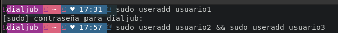
## 2. Asignación de Contraseñas
```bash
sudo passwd usuario1
sudo passwd usuario2
sudo passwd usuario3
```
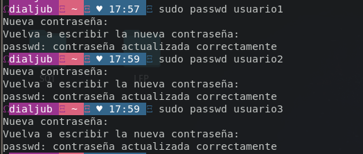
## 3. Información de Usuarios
```bash
id usuario1
```

## 4. Eliminación de Usuarios
```bash
sudo userdel usuario3
```
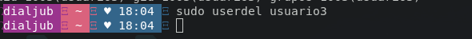

# Parte 2: Gestión de Grupos

## 1. Creación de Grupos
```bash
sudo groupadd usuario1 && sudo groupadd usuario2

```
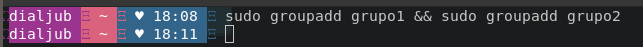
## 2. Agregar Usuarios a Grupos
```bash
sudo usermod -aG grupo1 usuario1 && sudo usermod -aG grupo2 usuario2

```

## 3. Verificar Membresía
```bash
groups usuario1
groups usuario2
```

## 4. Eliminar Grupo
```bash
sudo groupdel grupo2
```
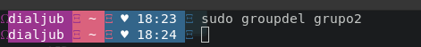

# Parte 3: Gestión de Permisos

## 1. Creación de Archivos y Directorios
```bash
sudo touch archivo1.txt
echo "Hola Sopes1" > ~/archivo1.txt
mkdir ~/directorio1
echo "HOla archivo 2" > ~/directorio1/archivo2.txt
```
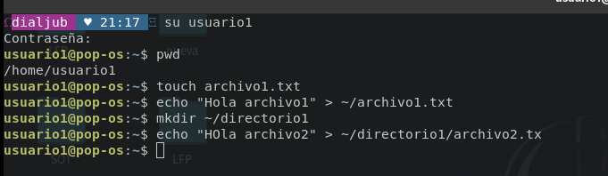
## 2. Verificar Permisos
```bash
ls -l ~/archivo1.txt
ls -ld ~/directorio1
```
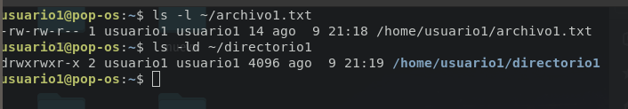
## 3. Modificar Permisos usando chmod con Modo Numérico
```bash
chmod 640 ~/archivo1.txt
```
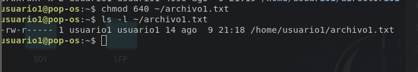

## 4. Modificar Permisos usando chmod con Modo Simbólico
```bash
chmod u+x ~/directorio1/archivo2.txt
```
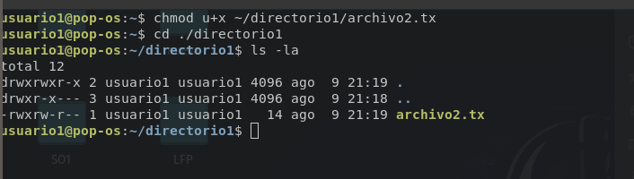
## 5. Cambiar el Grupo Propietario
```bash
sudo chown :grupo1 ~/directorio1/archivo2.txt
```

## 6. Configurar Permisos de Directorio
```bash
chmod 750 ~/directorio1
```

## 7. Comprobación de Acceso
```bash
cat ~/archivo1.txt
cat ~/directorio1/archivo2.txt
```
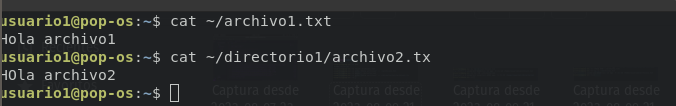

## 8. Verificación Final
```bash
ls -l ~/archivo1.txt
ls -ld ~/directorio1
ls -l ~/directorio1/archivo2.txt
```
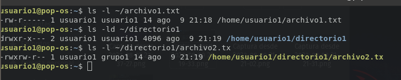

# Preguntas
### 1.¿Por qué es importante gestionar correctamente los usuarios y permisos en un sistema operativo? 
Es importante ya se puede dar en el que se maneja informacion sensible y puede si un usuario mal intencionado tiene permisos como super usuario puede llegar a borra, editar o agregar informacion que puede llegar a perjudicar a una persona o entidad.

### 1.¿Qué otros comandos o técnicas conocen para gestionar permisos en Linux? 
Una de las tecnicas es por medio de la GUI que nos proporciona el SO y comando existe otros como "chgrp, setfacl, getfacl, sudo".
