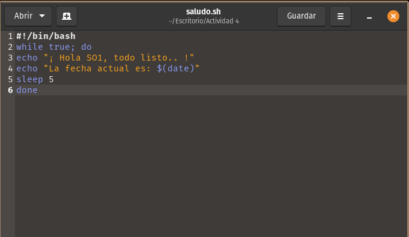
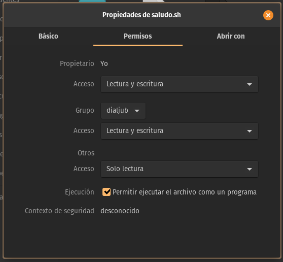
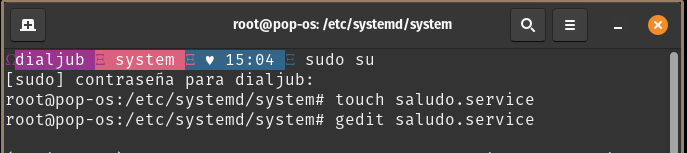
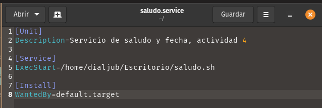
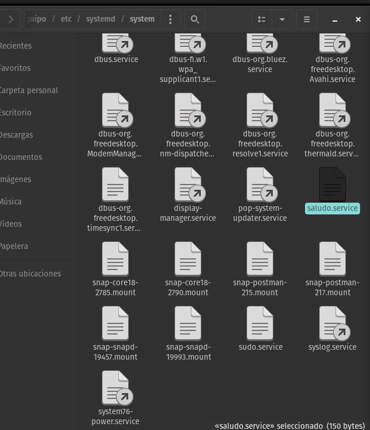
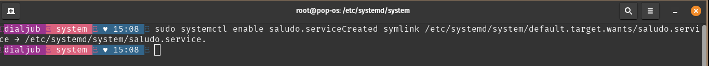

# Parte 1: Creacion del script
## 1. Creamos el script con el siguiente contenido:


## 1.1 Verificacion de permisos para el script


## 2. Creacion del servicio
## 2.1. Nos posicionamos en el directorio /system


## 2.2 Contenido del servicio:


## 2.3 Verificacion del servicio creado:


## 3. Habilitando el servicio
```bash
sudo systemctl enable saludo.service
```


## 4. Iniciando el servicio
```bash
sudo systemctl start saludo.service
```


## 5. Verificando el servicio
```bash
sudo systemctl status saludo.service
```

